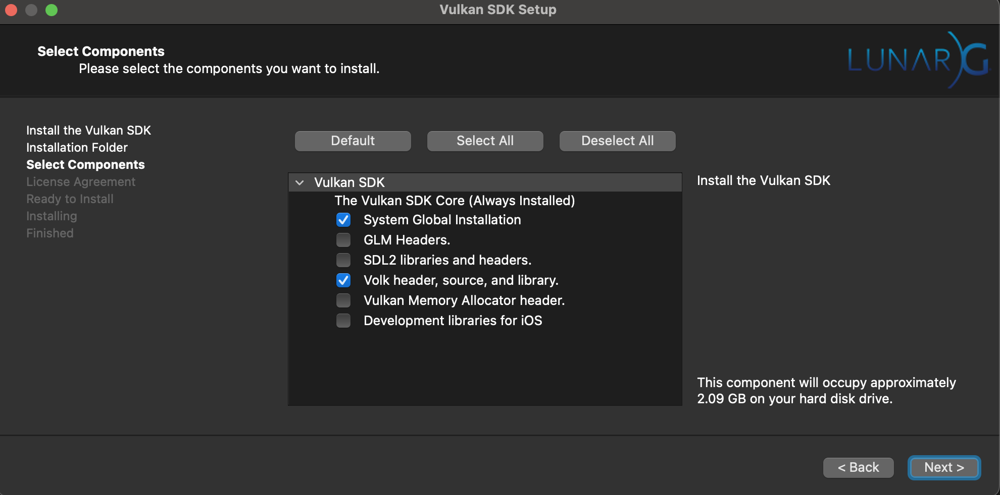

# 🛸 Getting Started

## ✅ Prerequisites

These are needed before working to get engine3d building successfully on your platform.

* `python`: 3.12 or above
* `conan`: 2.10.0 or above
* `llvm`: 17 or above
* `make`: CMake downloaded using conan to build Engine3D
* `git`: (only needs to be installed via installer on Windows)
* `Visual Studio Installer`: (Installer is for MSBuild to get C++ working on Windows)

=== "Windows"

    !!! info
        Needs to install Visual Studio's installer before using the `winget` command

    Run this `winget` command to setup C++ with Visual Studio installer in powershell (in admin mode)

    ```powershell
    winget install Microsoft.VisualStudio.2022.BuildTools --override "--add Microsoft.VisualStudio.Workload.VCTools --includeRecommended -p --installWhileDownloading"
    ```

    It is recommended to use Choco for an easy installation process on Windows.
    
    To install `choco`, open powershell with admin access and run the following command in your terminal (powershell must be admin):
    
    ```powershell
    Set-ExecutionPolicy Bypass -Scope Process -Force; [System.Net.ServicePointManager]::SecurityProtocol = [System.Net.ServicePointManager]::SecurityProtocol -bor 3072; iex ((New-Object System.Net.WebClient).DownloadString('https://community.chocolatey.org/install.ps1'))
    ```
    
    !!! tip
        If `choco` command does not work after running this script try closing and reopening powershell again.
        When `choco` prompts you to run install scripts from the commands below, enter `all` so it can install everything.
    
    Install `git` (powershell must be admin):
    ```powershell
    choco install git
    ```
    
    Install `python` (powershell must be admin):
    ```powershell
    choco install python --version=3.12.0
    ```
    
    Install `llvm` (powershell must be admin):

    !!! error
        If you get this error make sure that your environment variable is set to LLVM's clang.exe and clang++.exe filepath.

        While also making sure 
        
        ```
        CMake Error at CMakeLists.txt:2 (project):
        The CMAKE_CXX_COMPILER:

            C:/Program Files/LLVM/bin/clang++.exe

        is not a full path to an existing compiler tool.
        ```

    ```powershell
    choco install llvm
    ```
    
    Install `conan` (powershell must be admin)
    ```powershell
    pip install "conan>=2.10.2"
    ```

    Install cmake and make

    !!! error
        you can get this error if you DO NOT have 'make' installed via choco

        ```
        CMake Error: CMake was unable to find a build program corresponding to "Unix Makefiles".  CMAKE_MAKE_PROGRAM is not set.  You probably need to select a different build tool.
        ```
    
    !!! error
        you can get this error if you DO NOT have 'mingw' installed via choco

        CMake Error: CMake was unable to find a build program corresponding to "MinGW Makefiles".  CMAKE_MAKE_PROGRAM is not set.  You probably need to select a different build tool.

    ```powershell
    choco install make cmake
    ```

    !!! info

        mingw is installed because we need `mingw32-make.exe` as dependencies will default to using "MinGW Makefiles" generator specified.
        which means that their CMake will look for `mingw32-make.exe` specific make executables instead of `make.exe`

    Install mingw
    ```powershell
    choco install mingw
    ```

    [comment]: <> (Vulkan Installer can be found here [here](https://vulkan.lunarg.com/sdk/home#windows))

    !!! info

        Using this `winget` command will install Vulkan's installer, set it up for you, and set the environment path variable.
    
    Installing Vulkan's installer from the terminal in powershell. (in admin mode)
    ```powershell
    winget install --id=KhronosGroup.VulkanSDK -e
    ```

    !!! tip
        Once you have completely finish installing. DONT FORGET to refresh your powershell before building the engine3d project.


=== "Ubuntu"

    Install wget if it isn't already on your system

    `sudo apt-get install wget`

    Install the latest version of `llvm`
    
    ``` bash
    wget https://apt.llvm.org/llvm.sh
    chmod +x llvm.sh
    sudo ./llvm.sh
    ```
    
    !!! info
    
        If your using 20.04, you have to upgrade Python to 3.10
    
    ``` bash
    sudo apt update
    sudo apt install software-properties-common -y
    sudo add-apt-repository ppa:deadsnakes/ppa
    sudo apt install Python3.10
    ```

    Installing Conan
    ``` bash
    python -m pip install -U "conan>=2.2.2"
    ```

    On Linux vulkan does not need 


=== "Mac OS"

    Install Homebrew:
    
    ```
    /bin/bash -c "$(curl -fsSL https://raw.githubusercontent.com/Homebrew/install/HEAD/install.sh)"
    ```
    Install latest version of Python && llvm:
    
    ```
    brew install python
    brew install llvm@17
    ```
    
    Install conan:
    
    !!! tip
        If using the conan command does not work after pip installing.

        Type the `brew install conan` command, instead.

    ```
    python3 -m pip install "conan>=2.2.2"
    ```
    
    Make `clang-tidy` available on the command line:
    
    ```
    sudo ln -s $(brew --prefix llvm)/bin/clang-tidy /usr/local/bin/
    ```
    
    Install Rosetta (only required for M1 macs):
    
    ```
    /usr/sbin/softwareupdate --install-rosetta --agree-to-license
    ```

    ```zsh
    curl -O https://sdk.lunarg.com/sdk/download/1.3.290.0/mac/vulkansdk-macos-1.3.290.0.dmg ${HOME}/Downloads
    ```

    During the installation select the checkbox's shown below.

    

    Once vulkan's installed apply the following export commands into your mac's `.zshrc` file
    
    ```zsh
        export VULKAN_SDK="${HOME}/VulkanSDK/1.3.290.0/macOS"
        export DYLD_LIBRARY_PATH="${VULKAN_SDK}/lib/libvulkan.1.3.290.dylib"
        export VK_ICD_FILENAMES="$VULKAN_SDK/share/vulkan/icd.d/MoltenVK_icd.json"
        export VK_LAYER_PATH="$VULKAN_SDK/share/vulkan/explicit_layer.d"
    ```

    !!! note

        To check if vulkan is installed, you should be able to type the following command `vkvia`

        This runs the vulkan basic cube program validating vulkan's been installed correctly.

    After adding these exports, refresh your `.zshrc` by doing `source ~/.zshrc`

---

# Setting up Conan

Now continue and setup conan

Setting up conan platform-dependent profile.

=== "Windows"

    If you are on an x86 architecture for Windows.
    
    ```powershell
    conan config install -sf profiles/x86_64/Windows/ -tf profiles https://github.com/engine3d-dev/conan-config.git
    ```

=== "X86 Linux"

    If you are on a linux platform that uses an x86 architecture.
    
    ```bash
    conan config install -sf profiles/x86_64/linux/ -tf profiles https://github.com/engine3d-dev/conan-config.git
    ```

=== "M1 Mac"

    If you are on an M1 Mac OS.

    ```zsh
    conan config install -sf profiles/armv8/mac/ -tf profiles https://github.com/engine3d-dev/conan-config.git
    ```

---

## Getting engine3d conan packages

Add the engine3d-conan repository to your system. This repository holds all of the engine3d packages.

```zsh
conan remote add engine3d-conan https://libhal.jfrog.io/artifactory/api/conan/engine3d-conan
```

## Contributing to Engine3D

If you want to contribute to Engine3D, create either a new branch to the engine3d repository.

```bash
git clone https://github.com/engine3d-dev/engine3d
cd engine3d/

conan build . -b missing
```

!!! tip
    `-b missing` will build and install any missing binaries of your dependencies into conan cache

!!! info
    `conan build .` will build the entire project

The editor executable can be found in the path `build/Release/Editor/Editor.exe`

---

## Different Build Types

There are two different build types that you can build engine3d in, `Release` and `Debug`.

`Release` will be turning on optimization and making your code size.

`Debug` is much slower than `Release`. Not recommended because used for testing and enabling debugging information.

---


