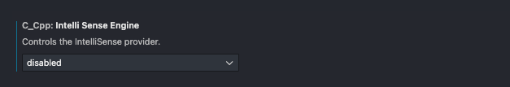
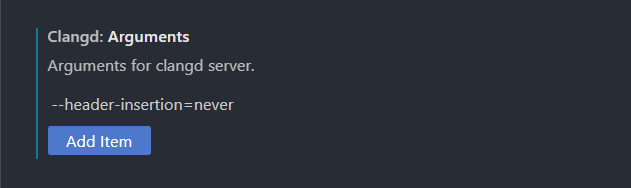

# 🕹️ Setting VSCode w/ `clangd`

The majority of the contributors and users uses Visual Studio Code. These guidelines should also help with non-vscoders as well.

## Setup VSCode Configuration

Make sure you already install clang via [getting started](../getting_started.md).

1. Install [VSCode](https://code.visualstudio.com/) if you haven't already done so.
2. Go to the "Extensions" section on left-side of the bar. It looks like 4 blocks with the upper right-hand block disconnected from the other 3. Hover over the icons to get their name.
3. Search for "C/C++" and disable the Windows intellisense extension if it is already installed and enabled.
4. Search for the extension `clangd` and install the extension.
5. Go to the `clangd` extension settings page. Find `clangd` extension and press the GEAR ⚙️ icon to open in settings.
6. Find the settings `clangd: Arguments` and add:
    1. In `Clangd: Arguments` input `--header-insertion=never`


## Disable VSCode Default Intellisense

When using `clangd` it will conflict with Visual Studio Code's default intellisense. This is how you can disable it.

Follow the same setups above. In the intellisense sections in the extensions for "C/C++".

Check the disable checkbox as shown below




## Disable auto-include headers

If you do not want auto-imported headers and are already including them if you have precompiled headers setup. This is how you can disable them.

Clangd arguments should look like this:



## Used in your own project

You can either add a `self.requires("engine3d-cmake-utils/4.0")` to your project or add the following lines to your `CMakeLists.txt`

```cmake
# Generate compile commands for anyone using our libraries.
set(CMAKE_EXPORT_COMPILE_COMMANDS ON)

# Always run this custom target by making it depend on ALL
add_custom_target(copy_compile_commands ALL
    COMMAND ${CMAKE_COMMAND} -E copy_if_different
    ${CMAKE_BINARY_DIR}/compile_commands.json
    ${CMAKE_SOURCE_DIR}/compile_commands.json
    DEPENDS ${CMAKE_BINARY_DIR}/compile_commands.json)
```

Run `conan build .` (where `.` is the path to your project/library) and it should generate the `compile_commands.json` file.

To ensure that the dependencies in your `conanfile.py` file that uses `self.requires` function.

!!! tip

    -b missing indicates to install any missing binaries for third party libraries that are missing

```zsh
conan build . -b missing
```


## How `clangd` works

Once you get `clangd` setup. Let me tell you how clangd works. Your workspace needs `compile_commands.json` file to be present or using `.clangd` in the root of your project's directory to be configured to know where to look for the location the `compile_commands.json` is located.

`compile_commands.json` tells `clangd` what commands you are using in order to determine exactly how your files are build and whjat commands are used to build them. Which provides the following benefits:

1. More accurate warnings and error messages within your IDE.
2. Faster response time because only the necessary includes for the specific version you are targeted will be used when evaluated.